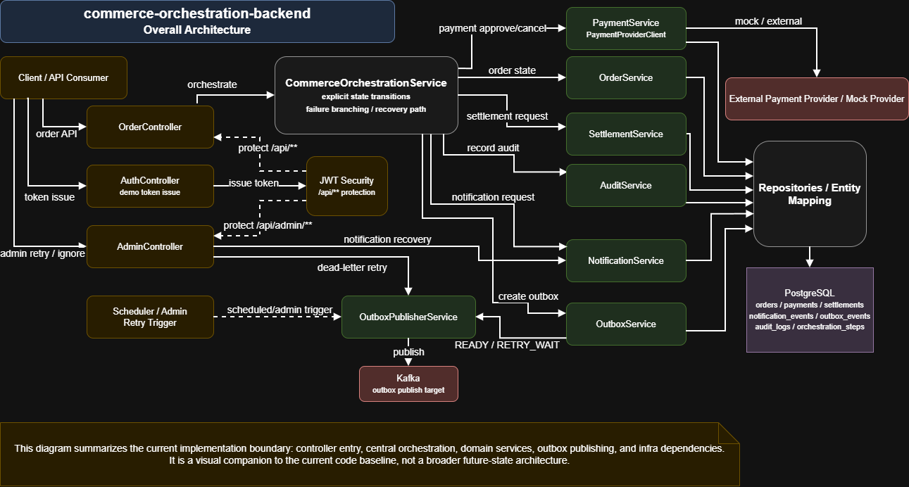

# commerce-orchestration-backend

Spring Boot 기반 orchestration backend입니다.  
주문 이후의 payment · settlement · notification · outbox 흐름을  
명시적 상태 전이, failure branching, recovery path 중심으로 제어하고 추적합니다.

이 프로젝트는 pinned 상태에서  
"주문 이후 orchestration을 어떻게 설계했고, 어디까지 검증했는가"를  
짧은 시간 안에 이해시키는 것을 우선합니다.

핵심 포인트는 세 가지입니다.

- **무엇을 제어하나:**  
  order 이후 payment, settlement, notification, outbox publish를 하나의 orchestration 흐름으로 제어합니다.
- **무엇을 증명하나:**  
  explicit state transition, failure branching, compensation, admin reprocessing, Flyway + integration-test 기준선을 함께 보여줍니다.
- **어디를 보면 되나:**  
  먼저 이 README를 보고, 이어서 [Docs Index](docs/README.md), [Architecture Notes](docs/architecture/README.md), [Flow Notes](docs/flows/README.md)를 보면 됩니다.

이 레포는 CRUD 화면 수나 엔드포인트 수보다 아래를 먼저 증명하는 데 초점을 둡니다.

- `CommerceOrchestrationService`를 중심으로 order lifecycle을 명시적으로 제어하는 것
- 상태 전이, 실패 분기, 운영 복구 지점을 `order status`, `orchestration step`, `outbox event`, `audit log`로 남기는 것
- settlement 실패와 notification 실패를 같은 오류로 뭉개지 않고 서로 다른 보상 경로로 다루는 것

## 1. Start Here

처음 보는 사람 기준 권장 읽기 순서는 아래입니다.

1. [Docs Index](docs/README.md)
2. [Architecture Notes](docs/architecture/README.md)
3. [Flow Notes](docs/flows/README.md)
4. [Design Notes](docs/design-notes.md)
5. [Test Report](docs/test-report.md) / [Troubleshooting](docs/troubleshooting.md)

draw.io 자산은 [Diagram Guide](docs/diagrams/README.md) 기준으로 관리합니다.
현재 overall architecture, order orchestration flow, outbox retry / dead-letter flow를 포함하고,
notification recovery flow와 table overview는 후속 작업으로 남겨 두었습니다.

## Diagram Snapshot

이 그림은 현재 구현 기준의 overall architecture를 한 장으로 요약한 미리보기입니다.



- overall architecture PNG:
  [commerce_orchestration_overall_architecture.png](docs/diagrams/png/commerce_orchestration_overall_architecture.png)
- draw.io 원본:
  [commerce_orchestration_overall_architecture.drawio](docs/diagrams/source/commerce_orchestration_overall_architecture.drawio)
- PDF:
  [commerce_orchestration_overall_architecture.pdf](docs/diagrams/pdf/commerce_orchestration_overall_architecture.pdf)

## 2. Snapshot

- **역할:**  
  주문 생성 이후 payment, settlement, notification, outbox publish를 orchestration 관점에서 제어하는 backend
- **강점:**  
  explicit state transition, compensation 분리, outbox retry/dead-letter, admin reprocessing
- **의존성 메모:** 현재 build.gradle에는 실제 구현 범위 외 의존성도 일부 함께 남아 있습니다.
  README와 설정의 정합성을 먼저 맞춘 뒤, 미사용 의존성은 후속 정리할 예정입니다.
- **현재 로컬 검증:**  
  `./gradlew clean test --rerun-tasks`, `./gradlew clean integrationTest --rerun-tasks --stacktrace`, `./gradlew integrationTest --rerun-tasks --stacktrace` 기준 통과
- **현재 CI 상태:**  
  GitHub Actions는 `build-and-test`, `integration-test` 두 job으로 유지 중이며, 이번 정리 기준에서 green 기준선을 다시 확보했습니다.

## 3. 이 레포가 현재 증명하는 것

- 주문 이후 후속 작업을 controller 단위로 흩뿌리지 않고 orchestration 서비스에서 흐름 중심으로 제어합니다.
- 주문 상태 전이는 묵시적 처리 대신 명시적 상태 변경으로 기록됩니다.
- outbox를 통해 후속 이벤트 발행을 분리하고, retry/dead-letter 전이를 코드와 데이터로 추적합니다.
- notification 실패는 단순 롤백이 아니라 `AUTO_RETRY`, `MANUAL_INTERVENTION`, `IGNORE` 정책으로 분기합니다.
- 운영자는 전체 orchestration 재실행이 아니라 실패한 하위 처리 단위를 admin 재처리 API로 복구할 수 있습니다.

## 4. 문제 정의

주문 생성 이후에는 결제 승인, 정산 요청, 알림 발송, 이벤트 발행, 실패 복구가 이어집니다.  
이 레포는 이 후속 흐름을 여러 controller와 ad-hoc service 호출에 분산시키지 않고,  
명시적 상태 전이와 운영 복구 경로가 보이는 orchestration backend로 정리하는 것을 목표로 합니다.

현재 기준선은 아래와 같습니다.

- 비즈니스 외부 진입점은 `OrderController`입니다.
- 인증용 `AuthController`는 데모 JWT 발급 보조 엔드포인트만 제공합니다.
- `CommerceOrchestrationService`는 흐름 제어만 담당합니다.
- `payment`, `settlement`, `notification`, `outbox`, `audit`는 각자 자기 repository를 내부 service가 소유합니다.
- 결제 provider는 `PaymentProviderClient` 인터페이스 아래 `mock` / `external` 구현으로 분리되어 있습니다.
- outbox는 `READY -> RETRY_WAIT -> PUBLISHED / DEAD_LETTER` 상태를 사용합니다.
- settlement 실패와 notification 실패는 동일 보상 정책으로 처리하지 않습니다.
- admin은 `notification-events`, `outbox-events` 단위로 명시적 재처리를 수행할 수 있습니다.
- DB 스키마의 source of truth는 Flyway migration입니다.

## 5. 핵심 설계

### Business Flow

1. `POST /api/orders`로 주문을 생성합니다.
2. `POST /api/orders/{orderId}/orchestrate`가 호출되면 orchestration이 시작됩니다.
3. payment 승인 후 주문을 `PAID`로 전이합니다.
4. settlement 요청 후 주문을 `SETTLEMENT_REQUESTED`로 전이하고 outbox event를 남깁니다.
5. notification 요청 후 주문을 `NOTIFICATION_REQUESTED`로 전이하고 outbox event를 남깁니다.
6. 최종적으로 `COMPLETED`, 또는 실패 분기에 따라 `FAILED` / `CANCELLED`로 종료합니다.

### Module Intent

- `order`  
  주문 생성, 상태 전이, 외부 비즈니스 진입 facade
- `orchestration`  
  흐름 제어, orchestration step 기록
- `payment`  
  결제 승인/취소와 provider 연동 추상화
- `settlement`  
  정산 요청 기록
- `notification`  
  알림 요청 기록
- `outbox`  
  이벤트 저장, 재시도, publish, dead-letter 전환
- `audit`  
  분기/재실행/실패 기록
- `common`  
  공통 응답, 예외, 공통 기반 타입

### Dependency Direction

- `controller -> facade/service -> repository`
- `orchestration -> domain application service`
- 다른 domain의 repository를 직접 주입해서 흐름을 제어하지 않습니다.
- repository 패키지를 외부에 공개하는 방식보다 service 경계를 통해 협력하는 방식을 우선합니다.

### 왜 이런 구조를 택했는가

- 흐름 제어를 한곳에 모아 order lifecycle의 분기와 종료 조건을 읽기 쉽게 유지합니다.
- 상태 전이와 보상 경로를 명시적으로 남겨 "어디서 실패했고 어떻게 복구할 수 있는가"를 추적 가능하게 만듭니다.
- outbox를 별도 관리해 후속 publish의 재시도와 dead-letter 전환을 비즈니스 처리와 분리합니다.
- notification 실패를 단순 rollback으로 처리하지 않고 운영 정책과 복구 방식의 차이를 드러냅니다.

## 6. Payment Provider 구조

`PaymentProviderClient`는 두 구현 중 하나가 설정으로 선택됩니다.

- `mock`  
  `MockPaymentProviderClient`  
  기본 모드입니다. `PAYMENT_PROVIDER_MOCK_FAILURE_TOKEN`이 description에 포함되면 실패를 시뮬레이션합니다.
- `external`  
  `ExternalPaymentProviderClient`  
  `baseUrl`, `apiKey`, `approvePath`, `cancelPath`, `connectTimeout`, `readTimeout`를 사용합니다.

현재 external 구현은 실제 연동을 붙일 수 있는 골격과 오류 매핑까지 포함하지만, provider별 상세 error mapping과 retry policy는 후속 과제입니다.

## 7. Outbox / Compensation 기준

### Outbox

- outbox event는 settlement / notification 후속 publish용으로 저장됩니다.
- publisher는 `nextAttemptAt`이 지난 `READY`, `RETRY_WAIT` 이벤트만 발행 대상으로 가져옵니다.
- publish 실패 시 `retryCount`, `failureCode`, `failureReason`, `nextAttemptAt`이 갱신됩니다.
- `maxRetryCount`를 초과하면 `DEAD_LETTER`로 전환됩니다.

### Compensation

- settlement 실패:  
  payment 취소 보상을 수행하고 주문을 `CANCELLED`로 마무리합니다.
- notification 실패:  
  payment/settlement를 되돌리지 않고 `FAILED` 상태와 `manual intervention / retry required` 성격의 compensation step을 남깁니다.

notification 운영 정책은 현재 1차 분리까지만 완료된 상태이며, 채널별 재전송/무시/운영자 개입 정책은 TODO입니다.

### Admin Reprocessing

- `POST /api/admin/notification-events/{id}/retry`  
  notification 실패 건을 재전송 성공으로 처리하고 주문을 `COMPLETED`로 복구합니다.
- `POST /api/admin/notification-events/{id}/ignore`  
  무시 가능한 notification 실패 건을 `IGNORED`로 정리하고 주문을 `COMPLETED`로 복구합니다.
- `POST /api/admin/outbox-events/{id}/retry`  
  `DEAD_LETTER` outbox event만 대상으로 즉시 재발행을 시도합니다.

현재 admin 재처리는 전체 orchestration 재실행이 아니라, 실패한 하위 처리 단위를 명시적으로 복구하는 방식입니다.

## 8. 현재 검증 범위

이 레포는 "흐름 제어와 실패 처리 구조가 실제로 동작하는가"를 현재 기준으로 아래까지 검증합니다.

- `./gradlew compileJava`  
  메인 소스 컴파일 확인
- `./gradlew test`  
  H2 + MockMvc 중심 단위/흐름 검증
- `./gradlew integrationTest`  
  PostgreSQL/Kafka Testcontainers 기반 통합 검증

현재 실제 구현 및 검증 범위는 아래를 포함합니다.

- order create / detail / flow API
- JWT 발급 및 `/api/**` 보호
- orchestration happy path
- settlement failure compensation
- notification failure 분기와 ignore policy
- admin notification / outbox reprocessing
- outbox publish 상태 전이
- PostgreSQL / Kafka 기반 outbox happy path integration test
- PostgreSQL / Kafka 기반 outbox retry -> dead-letter integration test

GitHub Actions workflow도 아래 두 job을 수행합니다.

- `build-and-test`  
  `compileJava`, `test`, unit report upload
- `integration-test`  
  `integrationTest`, integration report upload

이번 정리 시점의 로컬 재검증에서는 `test`, `integrationTest` 기준선을 다시 확인했습니다.  
README에서는 구현 범위를 과장하지 않고, "무엇을 검증하는 레포인지"와 "어디까지 확인했는지"를 분리해 적습니다.

## 9. 문서와 다이어그램 위치

- 문서 진입점: [Docs Index](docs/README.md)
- 구조 설명: [Architecture Notes](docs/architecture/README.md)
- 흐름 설명: [Flow Notes](docs/flows/README.md)
- 다이어그램 가이드: [Diagram Guide](docs/diagrams/README.md)

현재 아래 draw.io 자산을 관리합니다.
- overall architecture
- order orchestration flow
- outbox retry / dead-letter flow

아래 자산은 후속 작업으로 남겨 두었습니다.
- notification retry / manual intervention flow
- table relation overview

## 10. 아직 남은 범위

아래는 현재도 후속 과제로 유지하는 항목입니다.

- 실제 payment provider별 timeout / retry / error mapping 고도화
- notification 운영 정책의 세부 고도화
- dead-letter 이벤트의 운영 자동화
- refresh token / key rotation / user store 연동
- admin 레벨 재처리/재검증 API 고도화

짧게 말해 이 프로젝트는 CRUD showcase보다는 orchestration, explicit state transition, failure handling, 운영 복구 지점을 보여주는 포트폴리오 성격이 강합니다.

## 11. 로컬 실행

### Prerequisites

- Java 21
- Docker

### Quick Start

```bash
docker compose up -d
SPRING_PROFILES_ACTIVE=local ./gradlew bootRun
```

기본 로컬 값은 아래를 사용합니다.

- PostgreSQL: `jdbc:postgresql://localhost:5432/commerce_orchestration`
- Kafka: `localhost:9092`
- Kafka UI: `http://localhost:8085`
- payment provider mode: `mock`

`.env.example`을 참고해 환경변수를 맞출 수 있습니다.

### External Payment Provider 골격 확인

```bash
SPRING_PROFILES_ACTIVE=local \
PAYMENT_PROVIDER_MODE=external \
PAYMENT_PROVIDER_BASE_URL=http://localhost:8089 \
./gradlew bootRun
```

## 12. DB Schema / Migration

DB 스키마는 Flyway migration을 기준으로 관리합니다.

- 초기 스키마: [V1__init.sql](src/main/resources/db/migration/V1__init.sql)
- outbox retry / dead-letter 변경: [V2__outbox_retry_dead_letter.sql](src/main/resources/db/migration/V2__outbox_retry_dead_letter.sql)
- notification admin policy 변경: [V3__notification_admin_policy.sql](src/main/resources/db/migration/V3__notification_admin_policy.sql)

애플리케이션 기본/로컬/통합 테스트 프로필은 Flyway를 적용한 뒤 JPA `ddl-auto=validate`로 매핑 정합성을 확인합니다.  
단위 테스트용 `test` 프로필만 H2 `create-drop`과 `flyway disabled`를 유지합니다.

운영 점검용 SQL은 `docs/sql`에 정리되어 있습니다.

- [SQL Guide](docs/sql/README.md)
- [Outbox Operations](docs/sql/outbox-operations.sql)

## 13. Notification 운영 정책

- `AUTO_RETRY`  
  일시적 실패로 간주하며 notification event를 `RETRY_SCHEDULED`로 남깁니다.
- `MANUAL_INTERVENTION`  
  운영자 확인이 필요하며 notification event를 `MANUAL_INTERVENTION_REQUIRED`로 남깁니다.
- `IGNORE`  
  현재 범위에서 주문 완료를 막지 않아도 되는 실패로 보고 `IGNORED` 처리합니다.

현재 mock 분기 기준은 아래 description 토큰으로 시뮬레이션합니다.

- `FAIL_NOTIFICATION_RETRY`
- `FAIL_NOTIFICATION_MANUAL`
- `FAIL_NOTIFICATION_IGNORE`
- `FAIL_NOTIFICATION`

## 14. Docs

- [Docs Index](docs/README.md)
- [Architecture Notes](docs/architecture/README.md)
- [Flow Notes](docs/flows/README.md)
- [Diagram Guide](docs/diagrams/README.md)
- [Design Notes](docs/design-notes.md)
- [Test Report](docs/test-report.md)
- [Troubleshooting](docs/troubleshooting.md)
- [SQL Guide](docs/sql/README.md)
