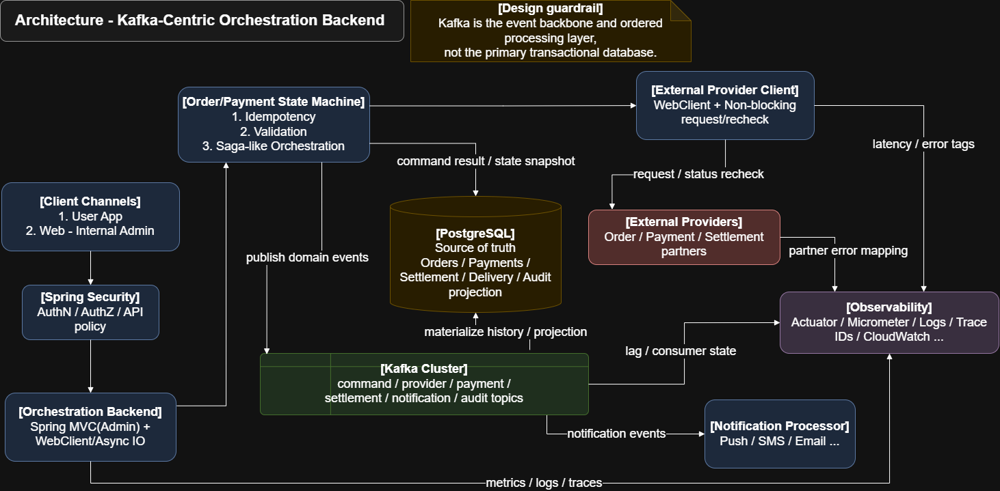

# commerce-orchestration-backend

주문 생성 이후 결제, 정산, 알림 같은 후속 작업이 이어지는 환경에서,  
단순 CRUD보다 **흐름 제어와 상태 가시성**이 더 중요하다는 점을 보여주기 위한  
Java / Spring Boot 기반 Commerce Orchestration Backend입니다.

이 프로젝트는 기능 수를 늘리는 것보다,  
**order lifecycle을 명시적 상태 전이와 orchestration step 기록으로 관리하고  
실패 분기와 후속 확장 포인트를 설명 가능한 구조로 만드는 것**에 초점을 맞췄습니다.

 

## 1. Quick Proof

- 이 프로젝트는 **commerce flow를 orchestration service가 제어하는 구조**를 초기 스캐폴드 수준에서 보여줍니다.
- 주문 상태를 단순 필드 변경이 아니라 **명시적 state transition**으로 다루는 방향을 드러냅니다.
- 결제 이후 정산과 알림을 **후속 단계로 분리**하고, orchestration step 이력으로 흐름을 추적할 수 있게 구성했습니다.
- 실패 분기와 재시도 강화 지점을 고려해 **compensation / retry / idempotency TODO 포인트**를 코드에 남겨 두었습니다.
- Kafka publish를 바로 붙이지 않아도 **Outbox 기반 확장 경로**를 먼저 확보하는 구조를 포함합니다.
- 즉, 이 프로젝트는 단순 주문 API 구현보다 **flow control, 운영 가시성, 확장 가능한 후속 처리 구조**를 먼저 보여주는 backend입니다.

 

## 2. Execution Evidence

### Architecture Overview

  

  
    Source:
    <a href="docs/diagram/kafka_orchestration_backend_architecture.drawio">draw.io</a> ·
    <a href="docs/pdf/kafka_orchestration_backend_architecture.pdf">PDF</a>
  

 

### Order Lifecycle Flow

다이어그램 추가 예정

 

### Verification Summary

| Scenario | Expected Behavior | Status | Evidence |
|---|---|---|---|
| `POST /api/orders` | 주문 생성 시 `CREATED` 상태로 저장 | Initial Scaffold | 코드 및 `docs/test-report.md` |
| `POST /api/orders/{orderId}/orchestrate` | 기본 happy path 기준 상태 전이와 orchestration step 기록 생성 | Initial Scaffold | 코드 및 `docs/test-report.md` |
| Order state transition | `CREATED -> PAYMENT_PENDING -> PAID -> SETTLEMENT_REQUESTED -> NOTIFICATION_REQUESTED` 전이 가능 | Initial Scaffold | 코드 및 `docs/test-report.md` |
| Orchestration history | 단계별 step 이력 조회 가능 | Initial Scaffold | 코드 및 `docs/test-report.md` |
| Settlement / Notification outbox | 후속 publish용 outbox event placeholder 생성 | Initial Scaffold | 코드 및 `docs/test-report.md` |
| Retry / compensation hardening | idempotency / retry / compensation 강화 포인트 명시 | Planned | `docs/design-notes.md` |
| External payment provider integration | 실제 PG 연동 없이 TODO 지점만 유지 | Planned | 코드 및 `docs/design-notes.md` |

### What This Proves

- 주문 이후의 후속 처리 흐름을 **중앙 orchestration 계층**으로 모을 수 있습니다.
- 주문 상태와 step 이력을 함께 관리해 **흐름 진행 상태를 해석할 수 있는 구조**를 설명할 수 있습니다.
- Kafka publish나 외부 PG 연동 전에도 **outbox, retry, compensation 확장 방향**을 코드 기준으로 제시할 수 있습니다.

 

## 3. Problem & Design Goal

커머스 시스템에서 주문 생성만 성공했다고 해서 실제 비즈니스 플로우가 끝난 것은 아닙니다.

- order 생성 후 payment가 실패할 수 있습니다.
- payment 성공 후 settlement나 notification이 누락될 수 있습니다.
- retry 과정에서 같은 요청이 중복 처리될 수 있습니다.
- 주문, 결제, 정산, 알림이 서로 직접 호출하며 강결합되면 변경 비용이 빠르게 커집니다.
- 운영 관점에서는 지금 어떤 주문이 어느 단계에서 멈췄는지 **상태 가시성**이 매우 중요합니다.

그래서 이 프로젝트는 CRUD API 수를 늘리는 것보다,  
**주문 이후 이어지는 flow를 어떻게 제어하고 관찰할 것인가**를 먼저 보여주도록 설계했습니다.

핵심은 데이터를 저장하는 것 자체보다,  
**다음 단계로 언제 넘어가고, 실패 시 어디서 멈추고, 어떤 후속 처리가 남아 있는지**를 설명 가능한 구조로 만드는 것입니다.

 

## 4. Key Design

### 1) 도메인 책임과 orchestration 책임 분리

- `order`, `payment`, `settlement`, `notification`은 각자 entity / repository / service를 가집니다.
- 전체 흐름 제어는 `CommerceOrchestrationService`가 담당합니다.
- 이를 통해 도메인 데이터 책임과 flow control 책임이 한 클래스에 섞이지 않도록 했습니다.

### 2) 명시적 상태 전이 설계

- 주문 상태는 `CREATED`, `PAYMENT_PENDING`, `PAID`, `SETTLEMENT_REQUESTED`, `NOTIFICATION_REQUESTED` 등으로 명시했습니다.
- 상태 전이를 코드에서 직접 드러내 운영 중 현재 위치를 해석하기 쉽게 했습니다.
- 추후 `FAILED`, `CANCELLED`, `COMPENSATED` 같은 분기를 확장하기 쉬운 형태로 시작했습니다.

### 3) 실패 분기 / 재시도 / 보상 처리 고려

- 현재 버전은 happy path 중심 초기 구현입니다.
- 대신 `retry`, `backoff`, `idempotency key`, `compensation` 강화가 필요한 지점을 TODO로 남겨 두었습니다.
- 즉, 초기 복잡도를 과하게 올리지 않으면서도 다음 구현 순서를 분명히 했습니다.

### 4) Outbox 기반 확장성

- settlement, notification 후속 처리를 outbox event로 남기도록 최소 구조를 만들었습니다.
- 실제 Kafka publish는 아직 구현하지 않고, publish 책임이 위치할 지점을 먼저 확보했습니다.
- 이 방식은 DB 상태 변경과 메시지 발행 사이의 책임 경계를 설명하기에 적합합니다.

### 5) 왜 기능 수보다 흐름 제어를 먼저 보여주는가

커머스 backend에서 더 어려운 지점은 엔드포인트 개수가 아니라,  
**여러 단계가 이어지는 흐름을 안정적으로 제어하는 일**입니다.

그래서 이 프로젝트는 초기 버전부터 많은 기능을 넣는 대신,  
주문 생성 이후의 흐름이 **어떤 상태와 기록으로 관리되는지**를 먼저 보여주는 방향을 선택했습니다.

 

## 5. Architecture / APIs

### Flow Summary

1. Client가 주문 생성 요청을 보냅니다.
2. `OrderController`가 요청을 수신하고 `OrderService`를 통해 주문을 `CREATED` 상태로 저장합니다.
3. `POST /api/orders/{orderId}/orchestrate` 호출 시 `CommerceOrchestrationService`가 흐름 제어를 시작합니다.
4. 주문 상태를 `PAYMENT_PENDING`으로 전이하고 payment step을 기록합니다.
5. 현재 버전에서는 mock 성격의 내부 처리로 payment를 승인하고 주문 상태를 `PAID`로 전이합니다.
6. settlement와 notification 후속 단계는 각 도메인 service와 outbox event placeholder를 생성하는 방식으로 기록합니다.
7. 클라이언트 또는 운영자는 주문 상세와 flow 조회 API를 통해 현재 상태와 step 이력을 확인할 수 있습니다.

### Package Summary

- `common`: 공통 API 응답, 예외, 베이스 엔티티
- `order`: public API 진입점과 주문 데이터 관리
- `payment`: 결제 상태 및 후속 provider 연동 확장 지점
- `settlement`: 정산 요청 상태 관리
- `notification`: 알림 이벤트 상태 관리
- `orchestration`: 전체 flow control과 step 기록
- `outbox`: 이벤트 publish 확장용 placeholder
- `audit`: 운영 추적용 로그 저장소
- `infrastructure.kafka`: topic name 상수

### Initial API List

- `POST /api/orders`
- `POST /api/orders/{orderId}/orchestrate`
- `GET /api/orders/{orderId}`
- `GET /api/orders/{orderId}/flow`

 

## 6. Why These Technologies

- **Spring Boot**: API, transaction, 예외 처리, 계층 구조를 빠르게 구성하기에 적합했습니다.
- **Spring Data JPA**: 초기 스캐폴드 단계에서 도메인 상태와 관계를 코드로 명확히 표현하기 좋았습니다.
- **PostgreSQL**: 주문과 후속 처리 상태를 영속화하는 기본 저장소로 적합합니다.
- **Kafka**: settlement / notification 같은 비동기 후속 처리를 확장할 때 자연스럽게 연결할 수 있습니다.
- **Docker**: PostgreSQL, Kafka 같은 인프라를 로컬에서 반복적으로 검증하기 쉽습니다.
- **Gradle**: 빌드와 의존성 관리를 간결하게 유지할 수 있습니다.

 

## 7. Test / Exception / Extensibility

### Test Focus

- 주문 생성 시 기본 상태 저장 확인
- orchestration happy path 상태 전이 확인
- orchestration step 기록 확인
- settlement / notification outbox placeholder 생성 확인
- 예외 상황에서 `404`, `400`, `500` 응답 일관성 확인

### Exception Handling

- 공통 `ApiResponse` 포맷으로 성공 / 실패 응답을 정리합니다.
- `BusinessException`과 `ErrorCode`로 도메인 예외를 최소한으로 표준화합니다.
- 현재는 복잡한 provider 에러 매핑보다, 초기 스캐폴드에 필요한 명시적 실패 응답을 우선합니다.

### Extensibility

- payment provider 연동 추가
- outbox publisher 및 Kafka consumer 추가
- idempotency key와 중복 요청 방어 강화
- retry / backoff 정책 도입
- compensation 시나리오 구체화
- callback / admin / internal API 확장
- metrics / tracing / audit 강화

 

## 8. Notes / Blog

- [Architecture Notes](docs/architecture/README.md)
- [Flow Notes](docs/flows/README.md)
- [Design Notes](docs/design-notes.md)
- [Test Report](docs/test-report.md)
- [Troubleshooting](docs/troubleshooting.md)

### Development Notes

초기 프로젝트 부트스트랩 단계에서는 AI 도구(codex)를 활용해  
공통 패키지 구조, 반복성 높은 클래스 뼈대, README 초안을 빠르게 구성했습니다.

반면, 이 프로젝트의 핵심인 도메인 책임 분리, 상태 전이 흐름,  
Orchestration 경계, Outbox 확장 포인트, 공개 API 설계는 직접 판단하여 반영했습니다.  
또한 생성 결과는 그대로 수용하지 않고, compile 확인과 구조 수정, TODO 점검을 거쳐 현재 방향에 맞게 정제했습니다.